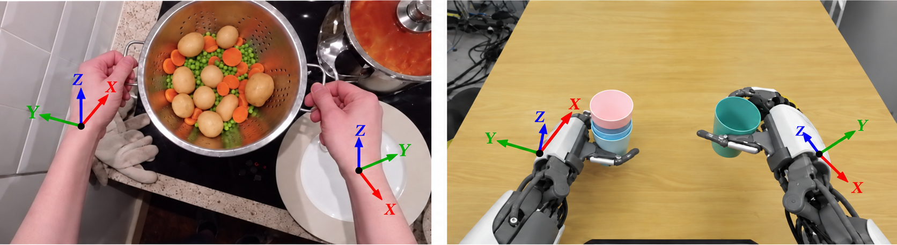
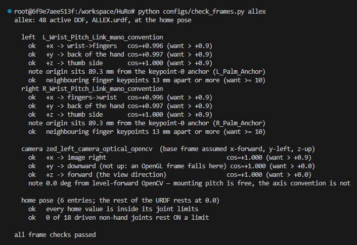

# Adding a robot

**Allex is the only robot this repository currently supports.** Adding another takes a URDF, one
YAML file in `configs/`, and an entry in the LeRobot conversion code (§6).

## 1. The URDF

Put the URDF in `assets/<robot>/urdf/` at the repository root, and its meshes in
`assets/<robot>/meshes/`. Git does not track the meshes, so copy them onto every machine
that runs the pipeline.

- **Meshes must resolve.** Use paths relative to the URDF, or `package://<pkg>/...`, which
  resolves `<pkg>` to the URDF's grandparent directory. A mesh that does not resolve leaves its
  link with **no visual geometry**. The overlay caches the robot in `build/overlay/`, so delete
  that directory after changing the meshes.
- **`<mimic>` joints are allowed.** List them in `mimic_joints` (§4).
- **The base frame must be x-forward, y-left, z-up** (ROS REP-103).

## 2. Frames the pipeline requires

The pipeline needs frames that a stock URDF usually lacks. Add each one to the URDF
as a zero-mass link on a fixed joint, and name it in the robot's YAML. Allex's
additions are in `submodules_patches/allex_model.patch`.

### The MANO wrist frames — `eef_link_names`

This link sets the frame of the exported wrist poses. **A wrong frame fails silently.**
The retargeting still looks right, but the wrist rotations in the data disagree with those
of every other robot.

[`examples/README.md`](../examples/README.md#coordinate-frames) defines the axes of this
frame. `+x` points toward the fingers on the left hand and back toward the wrist on the right,
`+y` points out of the back of the hand, and `+z` points toward the thumb side.

The fixed joint's `rpy` turns the parent link's axes into the `+x`, `+y` and `+z` above.
The parent's axes differ from robot to robot, so **work the `rpy` out for each robot rather
than copying Allex's.** The fixed joint's `xyz` sets the link's **origin**. Allex puts it
at the wrist pitch joint.

The figure below draws these axes on a person's hands and on Allex's hands.
`configs/check_frames.py` (§5) checks the link against them.



### The camera frame — `camera_link`

The retargeting matches this link to the camera pose of the human video, which uses the OpenCV
axes, **+x right, +y down, +z forward**. The link must use them too. A camera link that a URDF
already has may use other axes. In that case add a link on a fixed joint that turns them into
OpenCV's, as Allex does with `zed_left_camera_optical_opencv`.

## 3. The config

Copy `configs/allex.yaml` to `configs/myrobot.yaml` and work through it. Every field is
required unless marked otherwise.

```yaml
name: myrobot                        # optional label
robot_urdf_path: assets/myrobot/urdf/robot.urdf   # repo-root relative
```

- **`joints`** — the joint groups. `left_arm`, `left_hand`, `right_arm` and `right_hand` are
  **required**. Other groups, such as Allex's `waist` and `neck`, are optional and free-form.
  Joints in no group stay locked at the home pose. The groups and their joints can go in any
  order, which becomes the order the joint angles are stored in.
- **`hand_groups`** / **`stiff_groups`** (optional) — list the finger groups in `hand_groups`, so
  they can follow quick finger motion, and the waist, the neck and similar groups in
  `stiff_groups`, so they stay near the home pose. Leave the arm groups out of both.
- **`keypoint_mapping`** — per side, MediaPipe hand index → URDF link. Index 0 is the wrist, then
  thumb `1-4`, index finger `5-8`, middle `9-12`, ring `13-16`, pinky `17-20`,
  base→tip within each finger.

  **Indices `0, 1, 5, 9, 17` and the fingertips `4, 8, 12, 16, 20` are required.**
  The other indices are optional. The more of them are mapped, the more closely each finger
  follows the human finger.

  **The solver reads each link at the joint that moves it, so map each index to the link that
  starts at that joint.** On Allex the index finger's PIP, index 6, is `L_Index_Middle_Link`.

  Index 0 needs a link on the path from every finger back to the wrist. Use an existing link
  there, or add a zero-mass link on a fixed joint between the wrist and the palm, as Allex does
  with `L_Palm_Anchor` and `R_Palm_Anchor`.
- **`camera_link`**, **`eef_link_names`** — §2.
- **`eef_hand_joint_groups`** — per side, the `joints` group that holds the hand.
- **`home_config`** (optional but recommended) — the robot's **neutral pose**, as
  `joint_name: radians`. Joints it does not name rest at 0. The solver pulls the joints toward
  this pose. An all-zero pose, usually straight arms hanging down on a humanoid, makes the
  retargeting worse. Bend the elbows, keep the arm joints off their limits, and put the wrists
  neutral. The fingers can usually stay at zero.

## 4. The `overlay` block

```yaml
overlay:
  mimic_joints:
    L_Index_DIP_Joint: {parent: L_Index_PIP_Joint, multiplier: 0.656296489}
  hide_link_names:
    - Base_Link
```

- **`mimic_joints`** (optional) — copy it from the URDF's `<mimic>` tags.
- **`hide_link_names`** — every link outside the arms and the hands, since the overlay shows only
  those. Each name hides only that link's own geometry, not the links below it. A torso link left
  out of the list can block the whole camera view.

## 5. Checking the config

After writing the config, check it with `python configs/check_frames.py myrobot` before
running the pipeline. The script needs only numpy and PyYAML, so it runs before the environment
is built. For Allex it prints:



Then set `ROBOT="myrobot"` and `LAST_STAGE=9` in `run_pipeline.sh`, run it on the example clips,
and check that the videos in `examples/clips_chunked/myrobot/overlay/video/`
show the arms and hands.

## 6. The LeRobot conversion

Copy Allex's entry in `_LEROBOT_TARGETS` of `pipeline/stage10_lerobot_convert.py` and edit it:

- `target_joint_names` — the joint order of the dataset's `observation.state` and `action`. It
  must contain every joint of the `joints` groups. Extra names become always-zero slots. Use the
  order the downstream trainer expects.
- `state_name_suffix` — appended to the joint names for the state feature (`"_Qpos"` for Allex).
- `video_key` — `observation.images.<key>`.
- `create_modality_json` — the function that builds `meta/modality.json`. Write one that
  matches `target_joint_names` and `video_key`.
